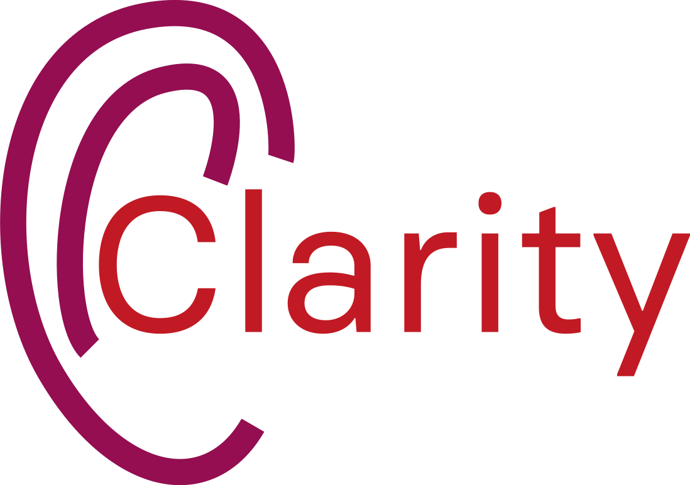
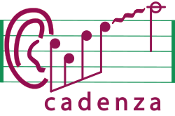

<!-- markdownlint-disable MD041 -->
<div align="center">

<h1>Machine learning challenges for hearing aid processing</h1>

<p align="center">
  

  
<p>

[](https://badge.fury.io/py/pyclarity)
[](https://pypi.org/project/pyclarity/)
[](https://app.codecov.io/gh/claritychallenge/clarity)
[](https://github.com/psf/black)
[](https://github.com/PyCQA/pylint)
[](https://results.pre-commit.ci/latest/github/claritychallenge/clarity/main)
[](https://pepy.tech/project/pyclarity)

[](https://pypi.org/project/pyclarity/0.4.0/)
[](https://pypi.org/project/pyclarity/0.2.1/)
[](https://pypi.org/project/pyclarity/0.1.1/)
[](https://figshare.shef.ac.uk/articles/software/clarity/23230694/1)
</p>

</div>

---

We are organising a series of machine learning challenges to enhance hearing-aid signal processing and to better predict how people perceive speech-in-noise (Clarity) and speech-in-music (Cadenza). For further details of the Clarity Project visit [the Clarity project website](http://claritychallenge.org/), and for details of our latest Clarity challenges visit our [challenge documentation site](https://claritychallenge.github.io/clarity_CC_doc/). You can contact the Clarity Team by email at [claritychallengecontact@gmail.com](claritychallengecontact@gmail.com). For further details of the Cadenza Project visit [the Cadenza project website](http://cadenzachallenge.org/), and to find out about the latest Cadenza challenges join the [Cadenza Challenge Group](https://groups.google.com/g/cadenza-challenge).

In this repository, you will find code to support all Clarity and Cadenza Challenges, including baselines, toolkits, and systems from participants. **We encourage you to make your system/model open source and contribute to this repository.**

## Current Events

- The ICASSP 2024 Cadenza Challenge (CAD_ICASSP_2024) is now open. :fire::fire:
  - Join the [Cadenza Challenge Group](https://groups.google.com/g/cadenza-challenge) to keep up-to-date on developments.
  - Visit the Cadenenza Challenge [website](https://cadenzachallenge.org/) for more details.
- The first Cadenza Challenge (CAD1) is closed.
  - Subjective Evaluation is underway. :new:
- The 2nd Clarity Prediction Challenge (CPC2) is now open.   :fire::fire:
  - Join the [Clarity Challenge Group](https://groups.google.com/g/clarity-challenge) to keep up-to-date on developments.
  - Visit the Clarity Challenge [website](https://claritychallenge.org/) for more details.
  - Evaluation tools and a baseline system will be available shortly.
- The 4th Clarity Workshop will be held as a satellite event of Interspeech 2023. For details visit the [workshop website](https://claritychallenge.org/clarity2023-workshop/).

## Installation

### PyPI

Clarity is available on the [Python Package Index (PyPI)](https://pypi.org/project/pyclarity) to install create and/or
activate a virtual environment and then use `pip` to install.

```bash
conda create --name clarity python=3.8
conda activate clarity

pip install pyclarity
```

### GitHub Cloning

```bash
# First clone the repo
git clone https://github.com/claritychallenge/clarity.git
cd clarity

# Second create & activate environment with conda, see https://docs.conda.io/projects/conda/en/latest/user-guide/install/index.html
conda create --name clarity python=3.8
conda activate clarity

# Last install with pip
pip install -e .
```

### GitHub pip install

Alternatively `pip` allows you to install packages from GitHub sources directly. The following will install the current
`main` branch.

```bash
pip install -e git+https://github.com/claritychallenge/clarity.git@main
```

## Challenges

Current challenge

- [The ICASSP 2024 Cadenza CHallenge](./recipes/cad_icassp_2024)

Previous challenges

- [The 1st Cadenza Challenge (CAD1)](./recipes/cad1)
- [The 2nd Clarity Prediction Challenge (CPC2)](./recipes/cpc2)
- [The ICASSP 2023 Enhancement Challenge](./recipes/icassp_2023)
- [The 2nd Clarity Enhancement Challenge (CEC2)](./recipes/cec2)
- [The 1st Clarity Prediction Challenge (CPC1)](./recipes/cpc1)
- [The 1st Clarity Enhancement Challenge (CEC1)](./recipes/cec1)

## Available tools

We provide also a number of tools in this repository:

- **Hearing loss simulation**
  - [Cambridge MSBG hearing loss simulator](./clarity/evaluator/msbg): descriptions can be found in the [CEC1
    description](./recipes/cec1); an usage example can be found in the [CEC1 baseline](./recipes/cec1/baseline)
    evaluation script `evaluate.py`.
- **Objective intelligibility measurement**
  - [Modified binaural STOI (MBSTOI)](./clarity/evaluator/mbstoi/mbstoi.py): a Python implementation of MBSTOI. It is
    jointly used with the MSBG hearing loss model in the [CEC1 baseline](./recipes/cec1/baseline). The official matlab
    implementation can be found here: <http://ah-andersen.net/code/>
  - [Hearing-aid speech perception index (HASPI)](./clarity/evaluator/haspi/haspi.py): a Python implementation of
    HASPI Version 2, and the better-ear HASPI for binaural speech signals. For official matlab implementation, request here: <https://www.colorado.edu/lab/hearlab/resources>
  - [Hearing-aid speech quality index (HASQI)](./clarity/evaluator/hasqi/hasqi.py): a Python implementation of
    HASQI Version 2, and the better-ear HASQI for binaural speech signals.
  - [Hearing-aid audio quality index (HAAQI)](./clarity/evaluator/haaqi/haaqi.py): a Python implementation of
    HAAQI.
- **Hearing aid enhancement**
  - [Cambridge hearing aid fitting (CAMFIT)](./clarity/enhancer/gha/gainrule_camfit.py): a Python implementation of CAMFIT, translated from the [HörTech Open Master Hearing Aid (OpenMHA)](http://www.openmha.org/about/); the CAMFIT is used together with OpenMHA enhancement as the [CEC1 baseline](./recipes/cec1/baseline), see `enhance.py`.
  - [NAL-R hearing aid fitting](./clarity/enhancer/nalr.py): a Python implementation of NAL-R prescription fitting. It is used as the [CEC2 baseline](./recipes/cec2/baseline), see `enhance.py`.

In addition, differentiable approximation to some tools are provided:

- [x] [Differentiable MSBG hearing loss model](./clarity/predictor/torch_msbg.py). See also the BUT implementation:
      <https://github.com/BUTSpeechFIT/torch_msbg_mbstoi>
- [ ] Differentiable HASPI (coming)

## Open-source systems

- CPC1:
  - [Exploiting Hidden Representations from a DNN-based Speech Recogniser for Speech Intelligibility Prediction in
    Hearing-impaired Listeners](./recipes/cpc1/e032_sheffield)
  - [Unsupervised Uncertainty Measures of Automatic Speech Recognition for Non-intrusive Speech Intelligibility
    Prediction](./recipes/cpc1/e029_sheffield)
- CEC1:
  - [A Two-Stage End-to-End System for Speech-in-Noise Hearing Aid Processing](./recipes/cec1/e009_sheffield)
