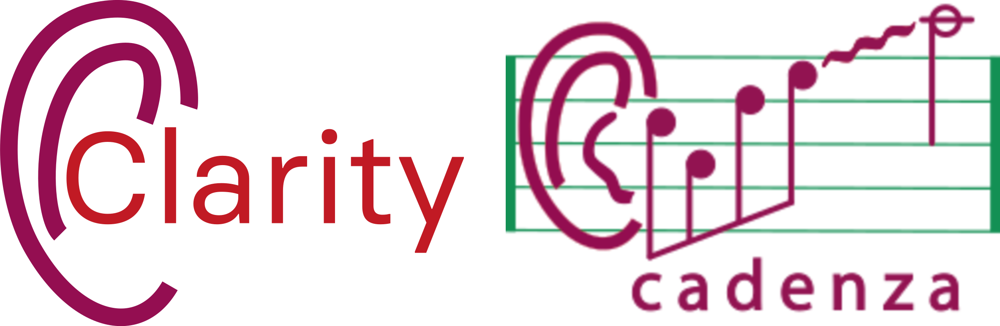

|

PyClarity documentation
=======================

PyClarity provides the core tools and functionalities used across
`Clarity Challenges <https://claritychallenge.org/>`_ and `Cadenza Challenges <https://cadenzachallenge.org/>`_.

Clarity Challenges
------------------

* `2nd Clarity Enhancement Challenge (CEC2) <https://claritychallenge.org/docs/cec2/cec2_intro>`_ (`GitHub Recipes <https://github.com/claritychallenge/clarity/tree/main/recipes/cec2>`__)
* `1st Clarity Enhancement Challenge (CEC1) <https://claritychallenge.org/docs/cec1/cec1_intro>`_ (`GitHub Recipes <https://github.com/claritychallenge/clarity/tree/main/recipes/cec1>`__)
* `1st Clarity Prediction Challenge (CPC1) <https://claritychallenge.org/docs/cpc1/cpc1_intro>`_ (`GitHub Recipes <https://github.com/claritychallenge/clarity/tree/main/recipes/cpc1>`__)

Cadenza Challenges
------------------

* `1st Cadenza Challenge (CAD1) <https://cadenzachallenge.org/docs/cadenza1/cc1_intro>`_ (`GitHub Recipes <https://github.com/claritychallenge/clarity/tree/main/recipes/cad1>`__)

.. toctree::
   :maxdepth: 4
   :caption: Getting Started:

   install

.. include:: _generated_menus.rst

